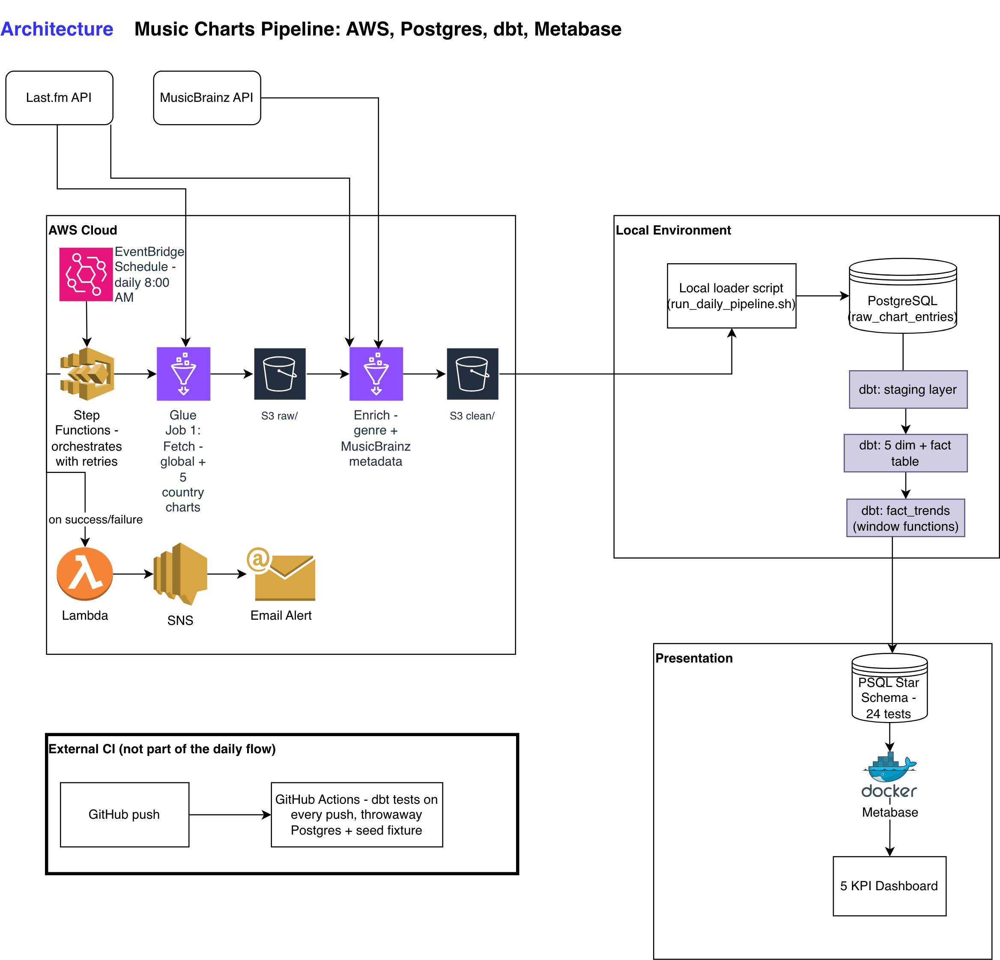
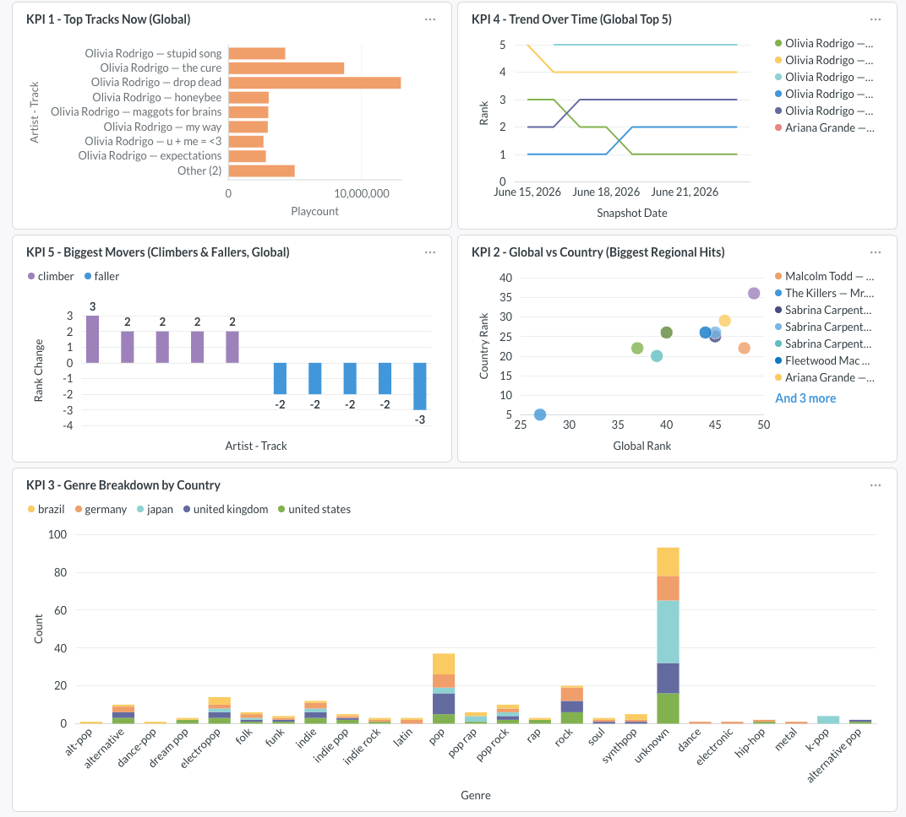

# Music Charts Pipeline

An automated data engineering pipeline that tracks daily music chart trends globally and across 5 countries.

## What it does

Fetches the Last.fm global chart and top charts for the United States, United Kingdom, Germany, Brazil, and Japan every day. Enriches each track with genre (from Last.fm crowd tags) and artist metadata (from MusicBrainz: origin country, type, gender, formation year). Stores everything in AWS S3, loads it into a local Postgres warehouse, models it as a star schema with dbt, and displays trend KPIs in a Metabase dashboard.

## Tech stack

| Layer | Tool |
|---|---|
| Data sources | Last.fm API, MusicBrainz API |
| Cloud ingestion | AWS Glue (Python Shell jobs) |
| Orchestration | AWS Step Functions + EventBridge |
| Notifications | AWS Lambda + SNS |
| Cloud storage | AWS S3 |
| Warehouse | PostgreSQL (local) |
| Transformation | dbt (dbt-postgres) |
| CI/CD | GitHub Actions |
| Dashboard | Metabase (Docker) |

## Pipeline architecture



## Data collected

- 300 rows per daily snapshot (50 tracks × 6 charts)
- Global chart + United States, United Kingdom, Germany, Brazil, Japan
- Fields: track name, artist, rank, genre, playcount, listeners, artist origin country, artist type, artist gender, formation year

## How to run it

This is the quickest path to seeing the project work end to end — fetch one day of data,
load it, build the star schema, and view it in Metabase. It doesn't require AWS access;
the cloud deployment (Glue + Step Functions + EventBridge) runs automatically in the
author's AWS account and is documented separately in `docs/PROJECT_PLAN.md`.

**Prerequisites:** Python 3.10+, a local PostgreSQL instance, Docker, and a free
[Last.fm API key](https://www.last.fm/api/account/create).

**1. Setup**
```bash
git clone <this repo>
cd music-charts-pipeline
python -m venv venv
source venv/bin/activate
pip install -r requirements.txt
```
Create a `.env` file in the project root with `LASTFM_API_KEY=your_key_here`, and create
a local Postgres database named `music_charts`.

**2. Fetch, enrich, and load one day of data**
```bash
python pipeline.py
python -c "from load_to_postgres import load; load()"
```
This fetches the global chart + 5 country charts, enriches with genre (Last.fm tags) and
artist metadata (MusicBrainz), runs data-quality checks, and loads the result into the
`raw_chart_entries` table in Postgres.

**3. Build the star schema with dbt**
```bash
cd music_charts
dbt run
dbt test
```

**4. View the dashboard**
```bash
docker run -d -p 3000:3000 --name metabase -v metabase-data:/metabase-data metabase/metabase
```
Open `http://localhost:3000`, connect to Postgres using host `host.docker.internal`
(not `localhost` — Docker containers can't reach the host machine that way) and database
`music_charts`, then explore the dimension/fact tables or rebuild the 5 KPI questions.

## Dashboard



## Project status

- ✅ Phase 0 — Setup
- ✅ Phase 1 — Thin slice (local end-to-end)
- ✅ Phase 2 — Full fetch + genre enrichment
- ✅ Phase 2b — MusicBrainz artist enrichment
- ✅ Phase 3 — AWS Glue cloud ingestion
- ✅ Phase 4 — Step Functions orchestration + notifications
- ✅ Phase 5 — dbt star schema (5 dimensions + fact table, window functions, 24 tests)
- ✅ Phase 6 — GitHub Actions CI/CD (dbt tests run on every push)
- ✅ Phase 7 — Metabase dashboard (5 KPIs)
- 🔄 Phase 8 — Docs & demo
